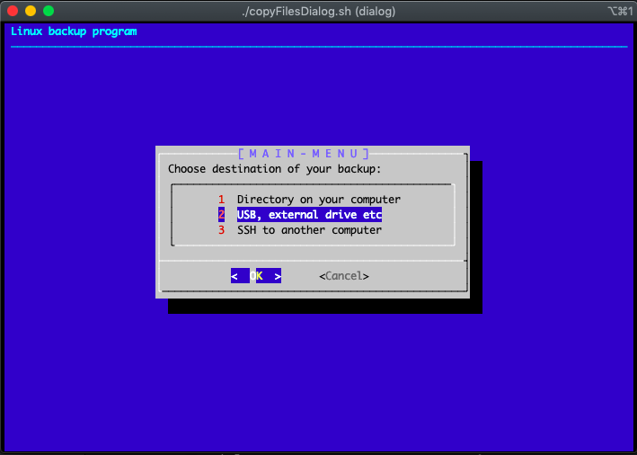

# Bash-archivizer

### Simple bash script for doing backups based on rsync 3.1.3 and dialog 1.3 for GUI

+ Step 1: Choose destination of your backup

+ Step 2: Choose folder, if folder does not exist it will be created

+ Step 3: Choose file/folder you want to copy

